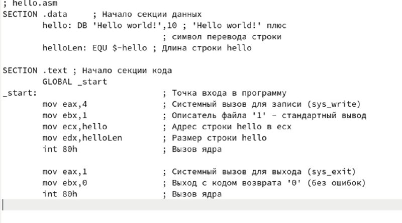
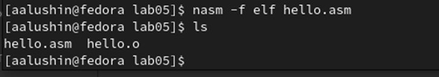
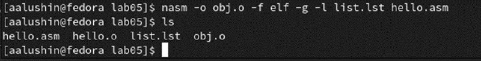
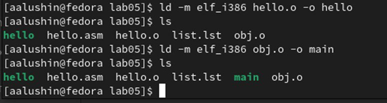
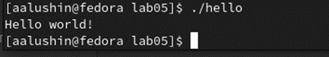
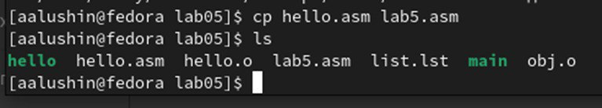
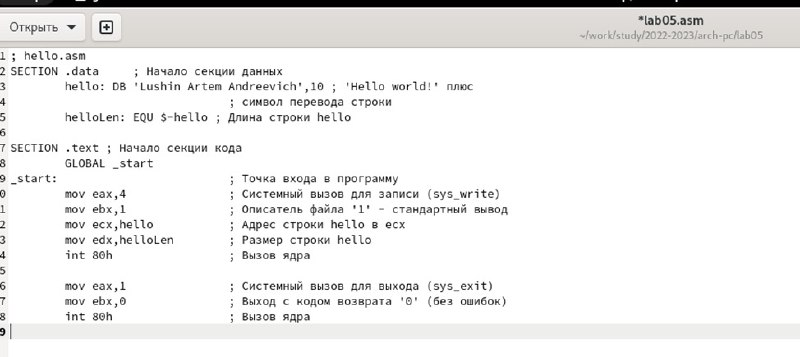
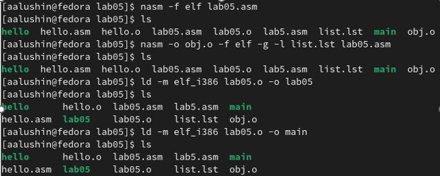
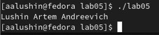
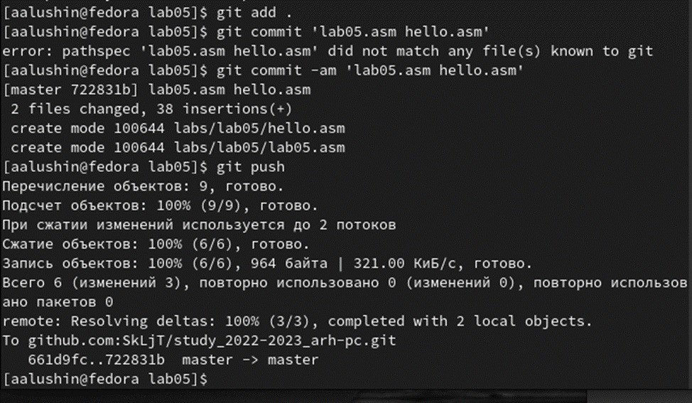

---
## Front matter
title: "Лабораторная работа №5."
subtitle: "Создание и процесс обработки программ на языке ассемблера NASM"
author: "Лушин Артем Андреевич"

## Generic otions
lang: ru-RU
toc-title: "Содержание"

## Bibliography
bibliography: bib/cite.bib
csl: pandoc/csl/gost-r-7-0-5-2008-numeric.csl

## Pdf output format
toc: true # Table of contents
toc-depth: 2
fontsize: 13pt
linestretch: 1.5
papersize: a4
documentclass: scrreprt
## I18n polyglossia
polyglossia-lang:
  name: russian
  options:
	- spelling=modern
	- babelshorthands=true
polyglossia-otherlangs:
  name: english
## I18n babel
babel-lang: russian
babel-otherlangs: english
## Fonts
mainfont: PT Serif
romanfont: PT Serif
sansfont: PT Sans
monofont: PT Mono
mainfontoptions: Ligatures=TeX
romanfontoptions: Ligatures=TeX
sansfontoptions: Ligatures=TeX,Scale=MatchLowercase
monofontoptions: Scale=MatchLowercase,Scale=0.9
## Biblatex
biblatex: false
biblio-style: "gost-numeric"
biblatexoptions:
  - parentracker=true
  - backend=biber
  - hyperref=auto
  - language=auto
  - autolang=other*
  - citestyle=gost-numeric
## Pandoc-crossref LaTeX customization
figureTitle: "Рис."
tableTitle: "Таблица"
listingTitle: "Листинг"
lolTitle: "Листинги"
## Misc options
indent: true
header-includes:
  - \usepackage{indentfirst}
  - \usepackage{float} # keep figures where there are in the text
  - \floatplacement{figure}{H} # keep figures where there are in the text
---

# Цель работы

Освоить процедуры компиляции и сборки программ, написанных на ассемблере NASM.

# Выполнение лабораторной работы

2.1) Я создал каталог lab05, затем перешел в него.

{ #fig:001 width=70% }

2.2) Я создал файл hello.asm и открыл его с помощью команды gedit.

{ #fig:002 width=70% }

2.3) Я ввел в файл нужный текст.

{ #fig:003 width=70% }

2.4) Я компилировал текст с помощью транслятора NASM.

{ #fig:004 width=70% }

2.5) Компилция файла hello.asm в obj.o

{ #fig:005 width=70% }

2.6) Обработка компановщиком файла hello.o и obj.o

{ #fig:006 width=70% }

2.7) Я запустил файла hello

{ #fig:007 width=70% }

# Выполнение самостоятельной работы.

3.1) C помощью команды cp я сделал копию файла hello.asm с именем lab05.asm

{ #fig:008 width=70% }

3.2) С помощью текстового редактора gedit я внес изменения в файл lab05.asm,чтобы он выводил мое ФИО

{ #fig:009 width=70% }

3.3) Я оттранслировал полученный текст и выполнил комоновку файла.

{ #fig:010 width=70% }

3.4) Я запустил файла lab05.

{ #fig:011 width=70% }

3.5) Я скопировал файлы в локальный репозиторий и загрузил их на GitHub.

{ #fig:012 width=70% }

# Вывод

Я освоил процедуры компиляции и сборки программы, написанные на ассемблере NASM

::: {#refs}
:::
