---
## Front matter
title: "Лабораторная работа №6"
subtitle: "Основы работы с Midnight Commander (mc). Структура программы на языке ассемблера NASM. Системные вызовы в ОС GNU Linux"
author: "Лушин Артем Андреевич"

## Generic otions
lang: ru-RU
toc-title: "Содержание"

## Bibliography
bibliography: bib/cite.bib
csl: pandoc/csl/gost-r-7-0-5-2008-numeric.csl

## Pdf output format
toc: true # Table of contents
toc-depth: 2
fontsize: 12pt
linestretch: 1.5
papersize: a4
documentclass: scrreprt
## I18n polyglossia
polyglossia-lang:
  name: russian
  options:
	- spelling=modern
	- babelshorthands=true
polyglossia-otherlangs:
  name: english
## I18n babel
babel-lang: russian
babel-otherlangs: english
## Fonts
mainfont: PT Serif
romanfont: PT Serif
sansfont: PT Sans
monofont: PT Mono
mainfontoptions: Ligatures=TeX
romanfontoptions: Ligatures=TeX
sansfontoptions: Ligatures=TeX,Scale=MatchLowercase
monofontoptions: Scale=MatchLowercase,Scale=0.9
## Biblatex
biblatex: false
biblio-style: "gost-numeric"
biblatexoptions:
  - parentracker=true
  - backend=biber
  - hyperref=auto
  - language=auto
  - autolang=other*
  - citestyle=gost-numeric
## Pandoc-crossref LaTeX customization
figureTitle: "Рис."
tableTitle: "Таблица"
listingTitle: "Листинг"
lofTitle: "Список иллюстраций"
lotTitle: "Список таблиц"
lolTitle: "Листинги"
## Misc options
indent: true
header-includes:
  - \usepackage{indentfirst}
  - \usepackage{float} # keep figures where there are in the text
  - \floatplacement{figure}{H} # keep figures where there are in the text
---

# Цель работы

Приобретение практических навыков работы в Midnight Commander. Освоение
инструкций языка ассемблера mov и int

# Выполнение лабораторной работы

1) С помощью команды mc я открыл Midnight Commander и нашел папку с лабораторной 5

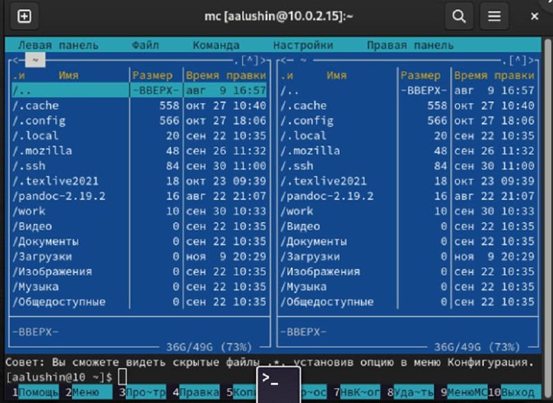{ #fig:001 width=70% }

2) Я создал папку lab06 и перешел в нее.

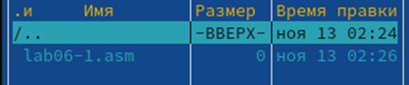{ #fig:002 width=70% }

3) Через строку ввода я создал файл lab6-1.asm

{ #fig:003 width=70% }

4) С помощью встроенного редактора я ввел текст программы и проверил его.

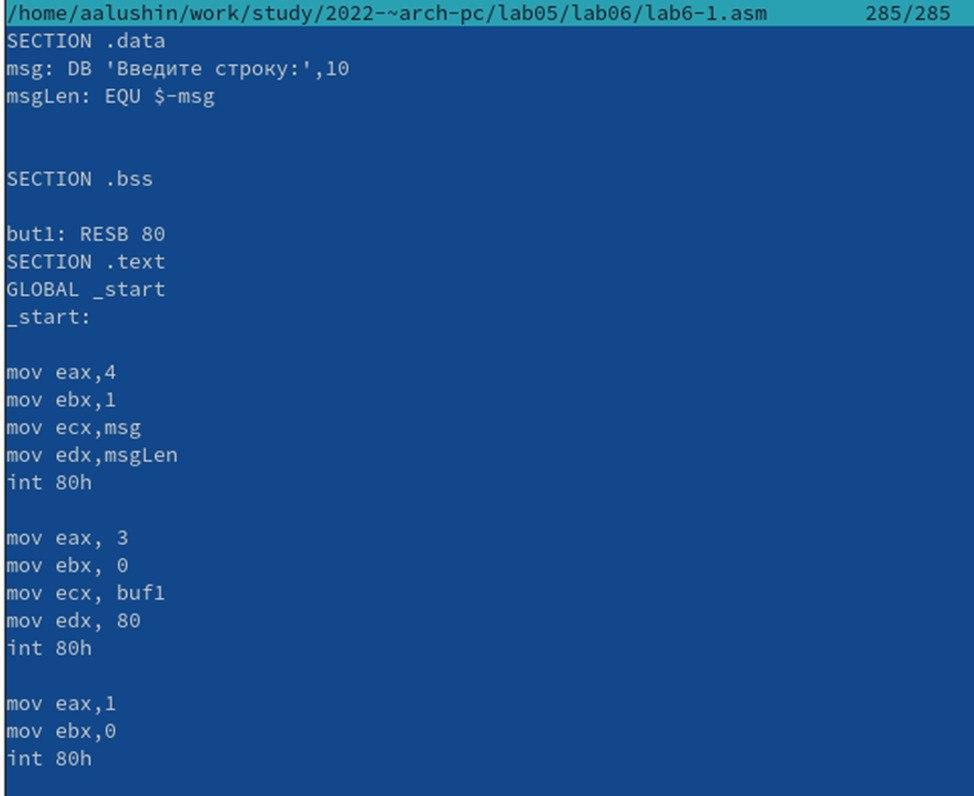{ #fig:004 width=70% }

5) Я оттранслировал текст в объектный файл. Выполнил компоновку и запустил файл программу.

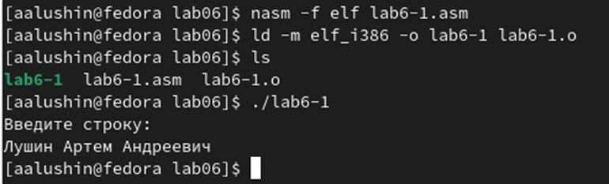{ #fig:005 width=70% }

6) Я скачал файл in_out.asm с ТУИС и перенес его в каталог lab06.

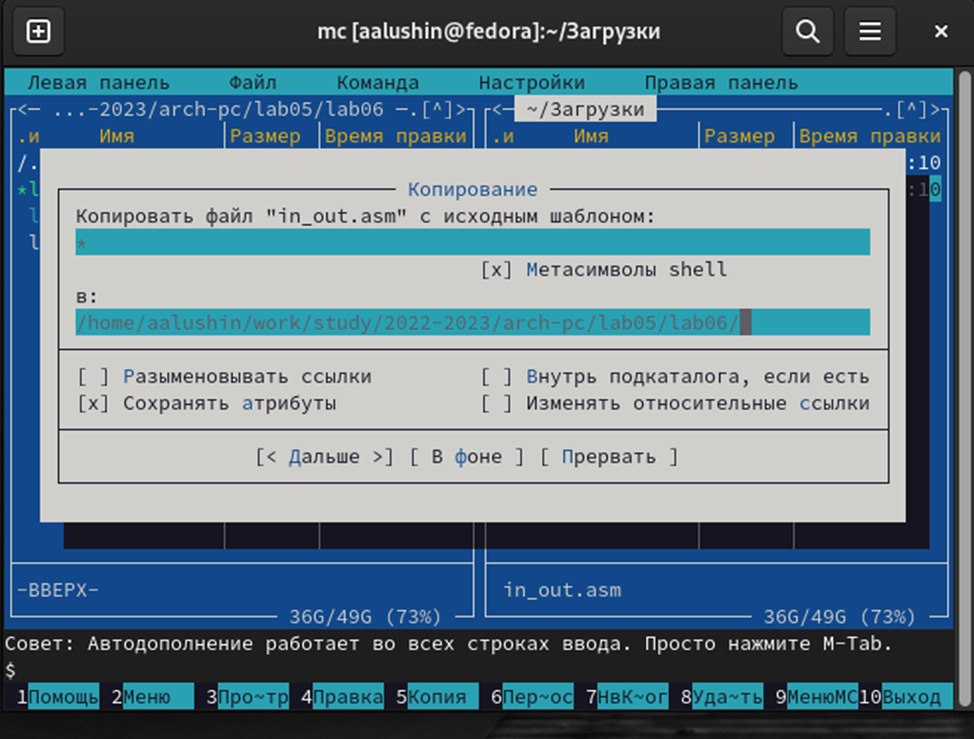{ #fig:006 width=70% }

7) Я создал копию файла lab6-1.asm и назвал ее lab6-2.asm.

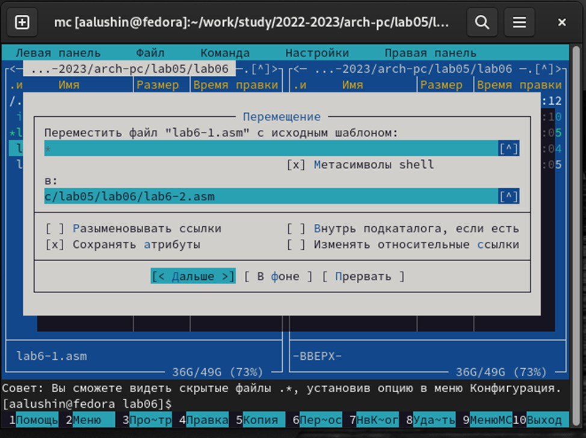{ #fig:007 width=70% }

8) Я исправил текст программы в файле lab6-2.asm с использованием программ из внешнего файла. Создал используемый файл и проверил его.

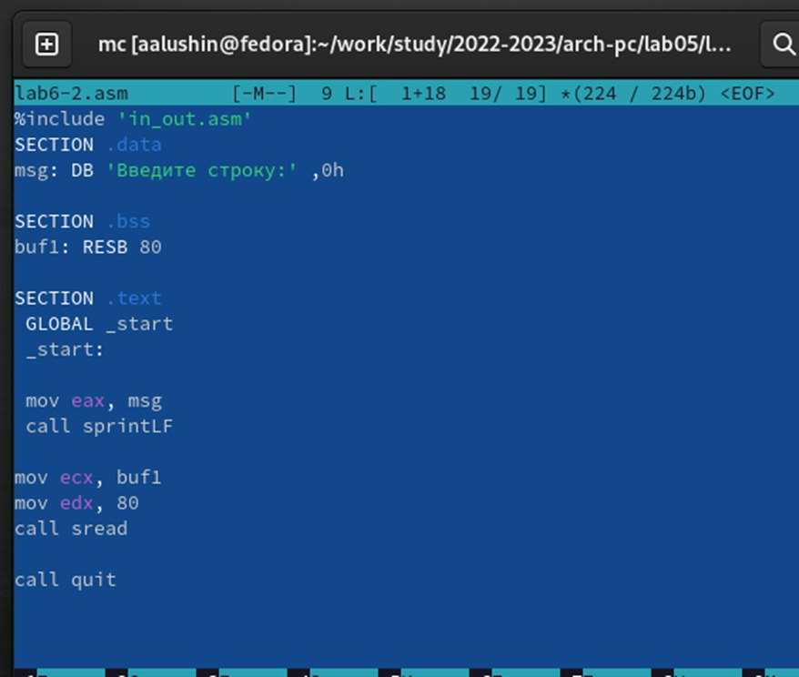{ #fig:008 width=70% }

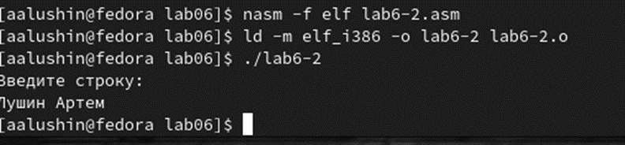{ #fig:009 width=70% }

9) Я заменил sprintLF на sprint в файле lab6-2. Проверил получившуюся программу. Разница между sprintLF и sprint в том, что в первом случае мы вводим текст ну другой строке, а во втором, на той же, где и текст запроса.

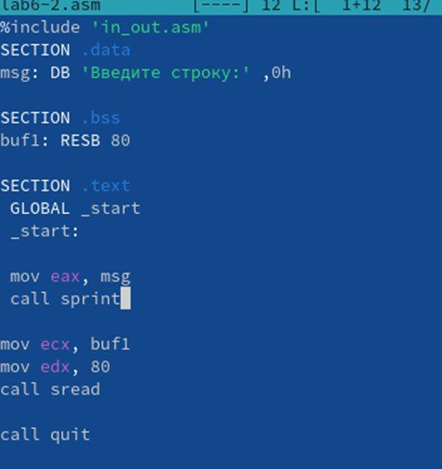{ #fig:010 width=70% }

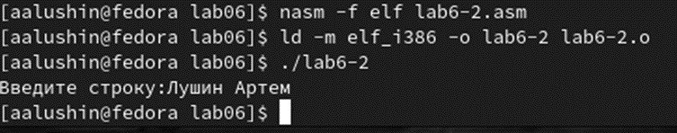{ #fig:011 width=70% }

# Самостоятельная работа

1) Я создал копию файла lab6-1.asm и назвал ее lab6-3.asm.Ввел текст чтобы программа выводила нужный результат.

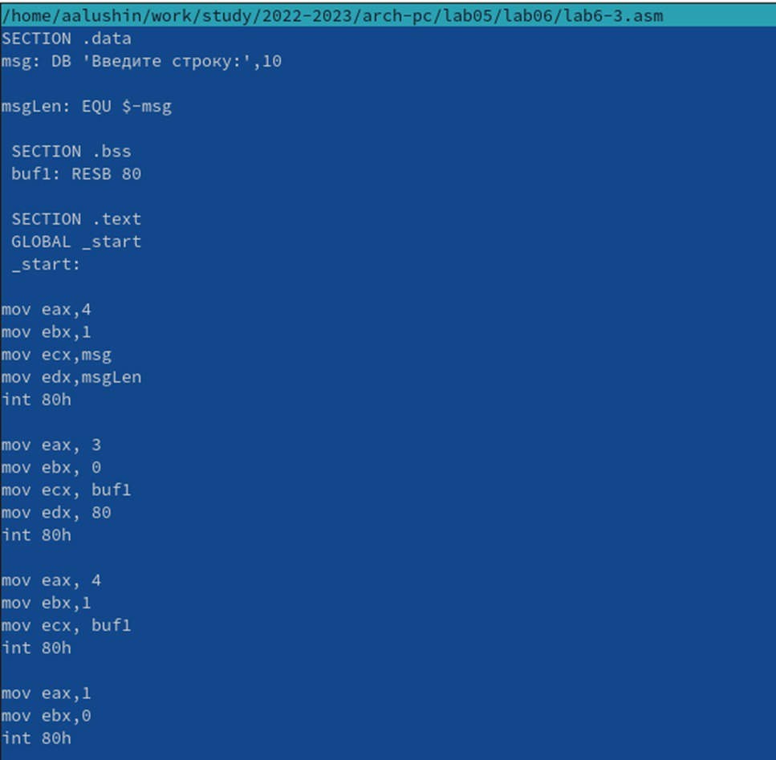{ #fig:012 width=70% }

2) Я проверил работу файла lab6-3.

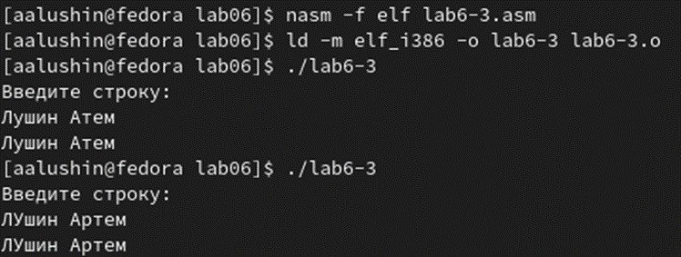{ #fig:013 width=70% }

3) Я создал копию файла lab6-2.asm и назвал ее lab6-4.asm. Ввел текст чтобы программа выводила нужный результат.

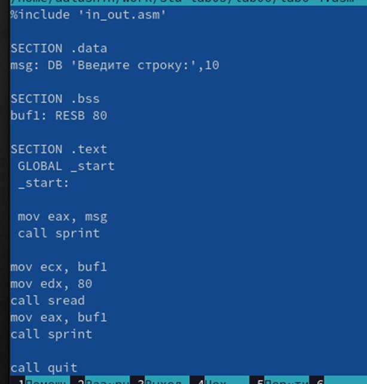{ #fig:014 width=70% }

4) Я проверил файл lab6-4.

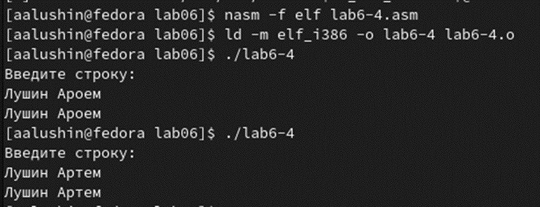{ #fig:015 width=70% }

5) Я загрузил результаты работы на GitHub.

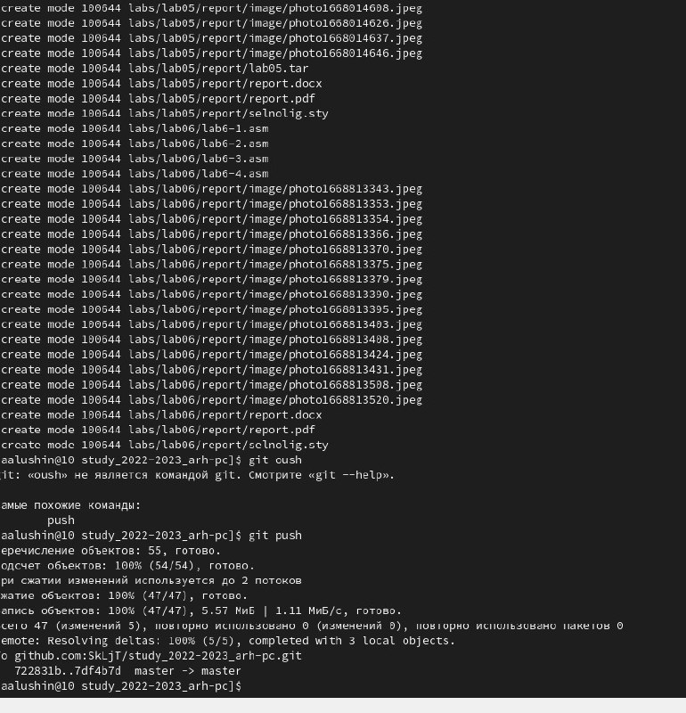{ #fig:016 width=70% }

# Вывод

Я приобрел практические навыки работы с Midnight Commander и освоил инструкцию языка ассемблера mov и int.

::: {#refs}
:::
