---
## Front matter
title: "Лабораторная работа №7"
subtitle: "Арифметические операции в NASM."
author: "Лушин Артем Андреевич"

## Generic otions
lang: ru-RU
toc-title: "Содержание"

## Bibliography
bibliography: bib/cite.bib
csl: pandoc/csl/gost-r-7-0-5-2008-numeric.csl

## Pdf output format
toc: true # Table of contents
toc-depth: 2
fontsize: 12pt
linestretch: 1.5
papersize: a4
documentclass: scrreprt
## I18n polyglossia
polyglossia-lang:
  name: russian
  options:
	- spelling=modern
	- babelshorthands=true
polyglossia-otherlangs:
  name: english
## I18n babel
babel-lang: russian
babel-otherlangs: english
## Fonts
mainfont: PT Serif
romanfont: PT Serif
sansfont: PT Sans
monofont: PT Mono
mainfontoptions: Ligatures=TeX
romanfontoptions: Ligatures=TeX
sansfontoptions: Ligatures=TeX,Scale=MatchLowercase
monofontoptions: Scale=MatchLowercase,Scale=0.9
## Biblatex
biblatex: false
biblio-style: "gost-numeric"
biblatexoptions:
  - parentracker=true
  - backend=biber
  - hyperref=auto
  - language=auto
  - autolang=other*
  - citestyle=gost-numeric
## Pandoc-crossref LaTeX customization
figureTitle: "Рис."
tableTitle: "Таблица"
listingTitle: "Листинг"
lofTitle: "Список иллюстраций"
lotTitle: "Список таблиц"
lolTitle: "Листинги"
## Misc options
indent: true
header-includes:
  - \usepackage{indentfirst}
  - \usepackage{float} # keep figures where there are in the text
  - \floatplacement{figure}{H} # keep figures where there are in the text
---

# Цель работы

Освоение арифметических инструкций языка ассемблера NASM.

# Выполнение лабораторной работы

1) Я создал каталог lab07 и внутри создал файл lab7-1.asm.

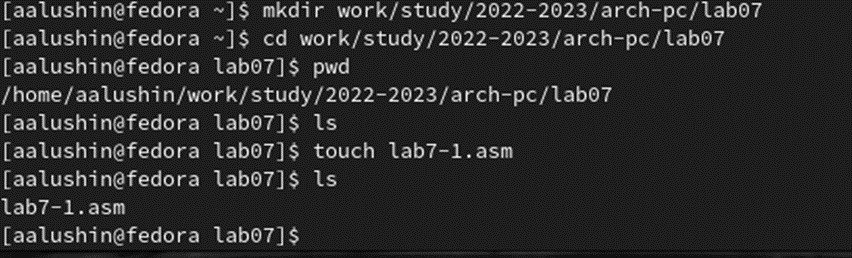{ #fig:001 width=70% }

2) В файл lab7-1.asm я ввел нужный текст, создал файл и проверил его. Программа вывела j.

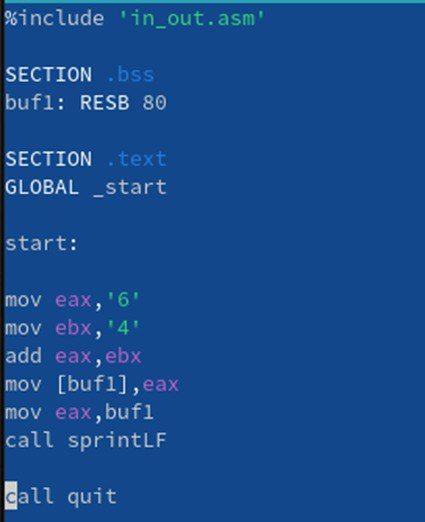{ #fig:002 width=70% }

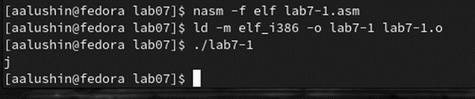{ #fig:003 width=70% }

3) Я изменил текст программы. Когда я сделал программу и запустил ее, она вывела невидимый символ, как и должна была.

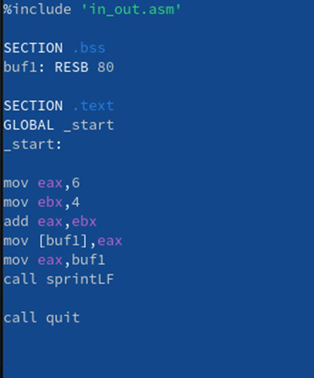{ #fig:004 width=70% }

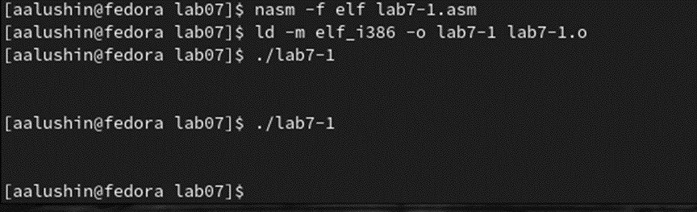{ #fig:005 width=70% }

4) Я создал файл lab7-2.asm и ввел в него текст программы.

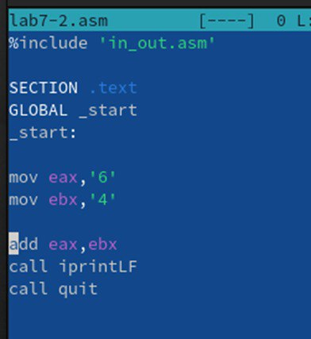{ #fig:006 width=70% }

5) Cоздал исполняемый файл и запустил его. Как и предполагалось, он вывел число 106.

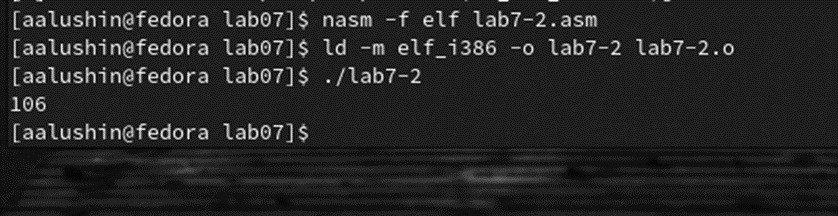{ #fig:007 width=70% }

6) Я изменил текст программы lab7-2 и запустил ее. Она вывела число 10, как и должна была.

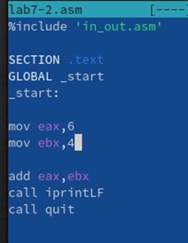{ #fig:008 width=70% }

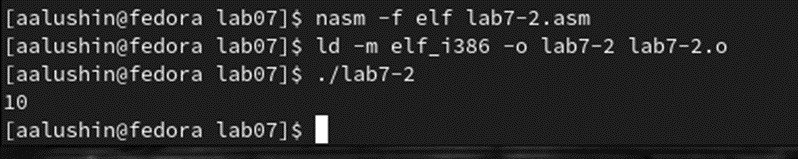{ #fig:009 width=70% }

7)Я заменил функцию iprintLF на iprint. Проверил файл и результат отличался в выводе данных. Когда используется команда iprintLF мы начинаем вводить команду на следующей строке, а при использовании команды iprint мы вводим следующие данные на той же строке.

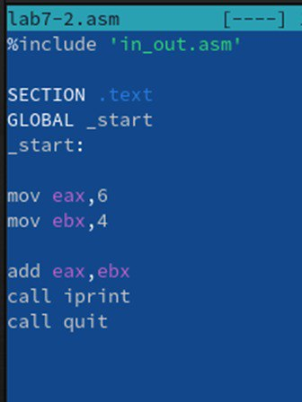{ #fig:010 width=70% }

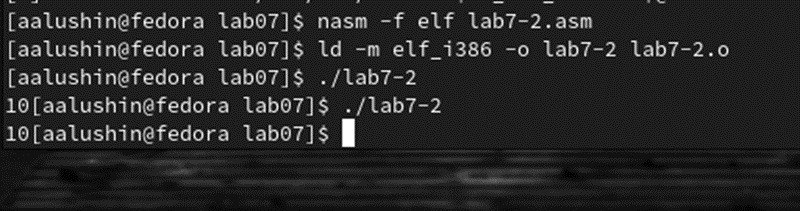{ #fig:011 width=70% }

8) Я создал файл lab7-3.asm и ввел текст программы. Запустил и проверил ее работу.

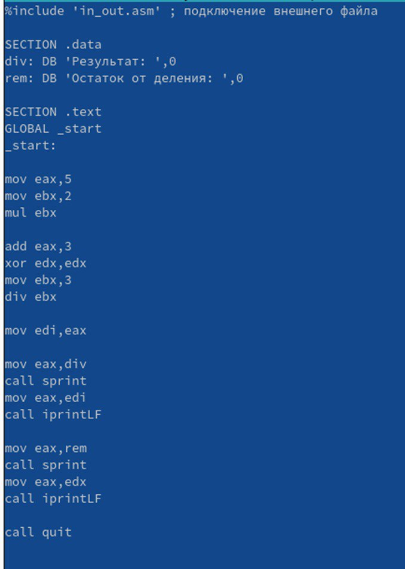{ #fig:012 width=70% }

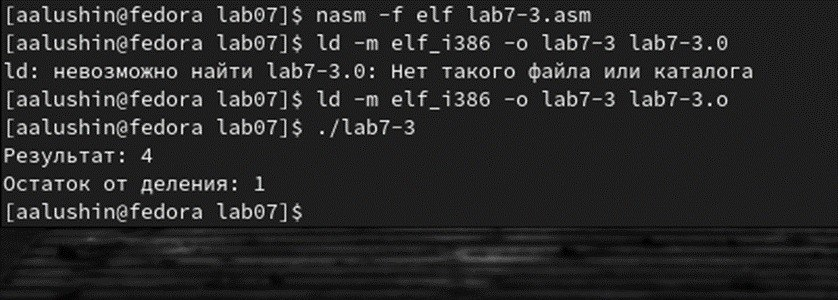{ #fig:013 width=70% }

9) Я изменил программу для примера F(x) = (4*6+2)/5. Запустил ее и проверил

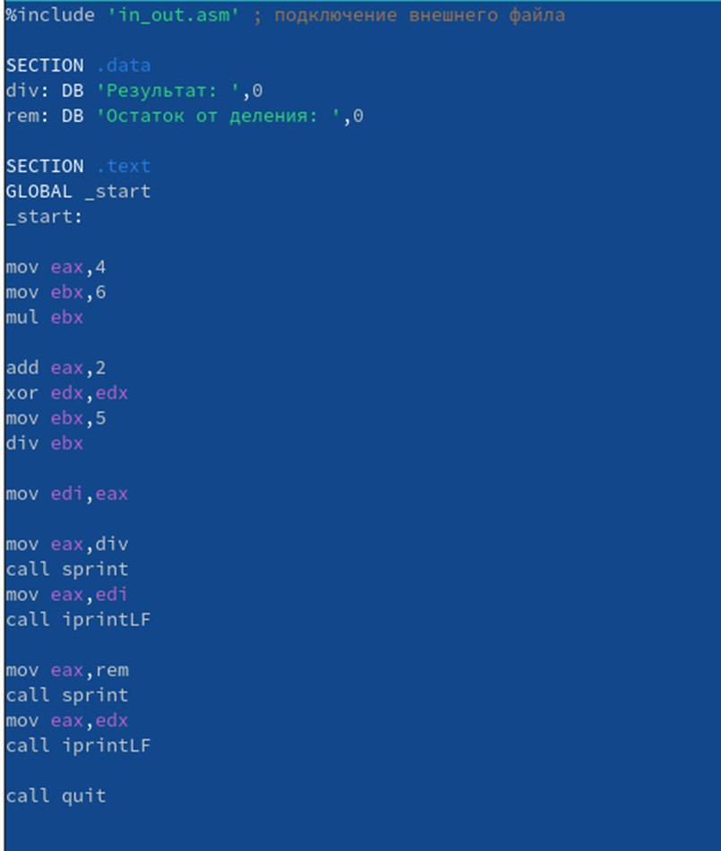{ #fig:015 width=70% }

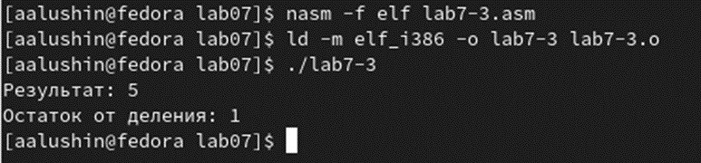{ #fig:016 width=70% }

10) Я создал файл variant.asm и ввел туда нужный текст.

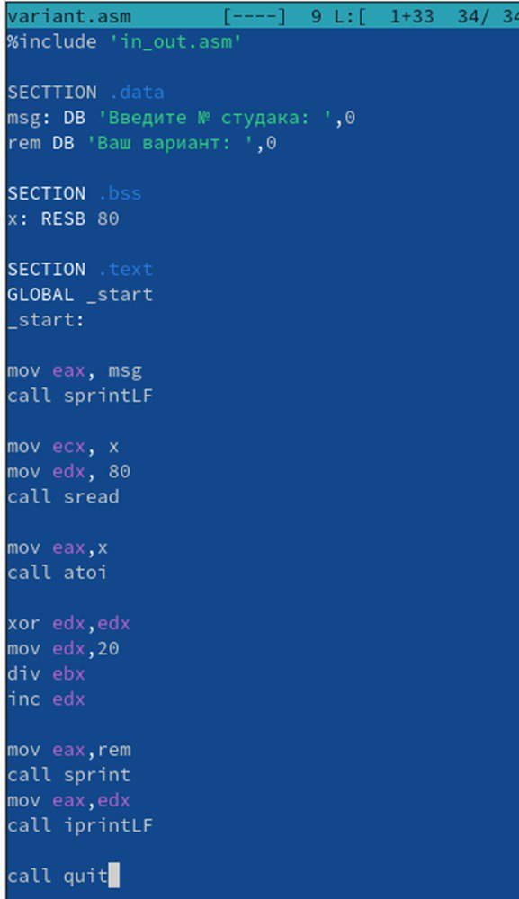{ #fig:017 width=70% }

11) Я ввел в эту программу свой студенческий билет "1132226520" Он вывел ответ 1, я проверил это аналитически, ответ совпал.

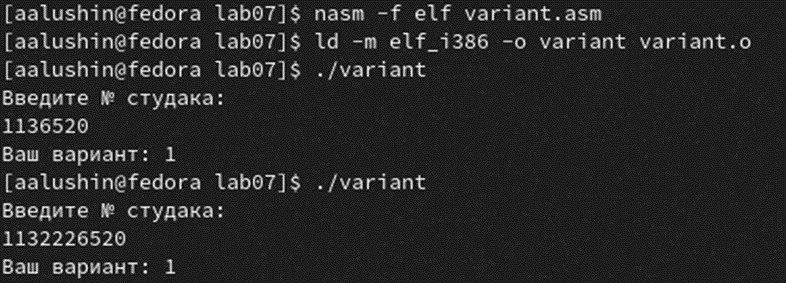{ #fig:018 width=70% }

# Вопросы:

1)Какие строки листинга 7.4 отвечают за вывод на экран сообщения ‘Ваш вариант:’? 

mov eax,msg
call sprintLF

2) Для чего используется следующие инструкции? nasm mov ecx, x
mov edx, 80 call sread

Эти инструкции используются для ввода переменной Х с клавиатуры и сохранения введенных данных.

3) Для чего используется инструкция “call atoi”?

Эта инструкция используется для преобразования Кода переменной ASCII в число.

4) Какие строки листинга 7.4 отвечают за вычисления варианта?

mov ebx,20
div ebx
inc edx

5)В какой регистр записывается остаток от деления при выполнении инструкции “div ebx”?

В регистре ebx.

6) Для чего используется инструкция “inc edx”?

Для увеличения значения edx на 1.

7)Какие строки листинга 7.4 отвечают за вывод на экран результата вычислений?

mov eax,edx
call iprintLF

# Самостоятельная работа

Я написал программу которая будет решать выражение и выводить ответ при введенных х. Так как в 11 пункте мне выдало 1 вариант, то программу я писал для выражения 
F(x) = (10+2x)/3. Я вводил значения переменных 1 и 10 и ответы выдавало правильные.

{ #fig:019 width=70% }

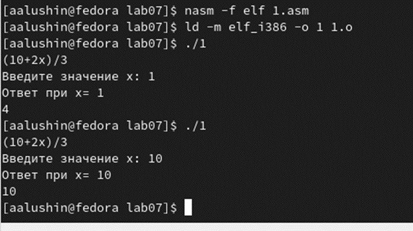{ #fig:020 width=70% }

# Вывод

Я освоил арифметические инструкции языка ассемблер NASM.

::: {#refs}
:::
